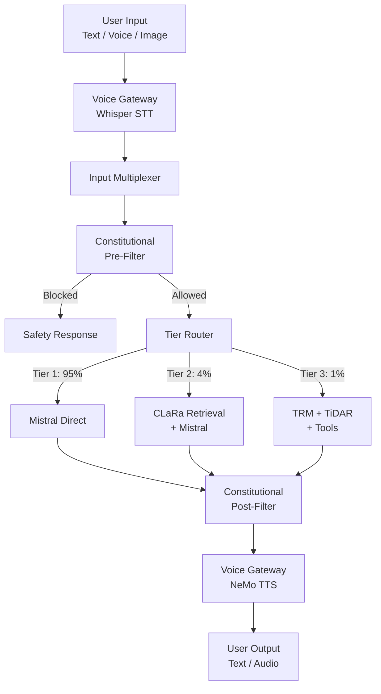

# Elara v2.0 Architecture

## System Overview



## Tier Architecture

### Tier 1: Direct Generation (95% of queries)
- **Path**: Input → Mistral → Output
- **Latency**: <100ms
- **Use case**: Simple queries, greetings, factual Q&A

### Tier 2: Retrieval-Augmented (4% of queries)
- **Path**: Input → CLaRa Retrieval → Augmented Prompt → Mistral → Output
- **Components**:
  - `SCPCompressor`: Compresses documents into memory tokens
  - `CLaRaStore`: Persistent vector store with mmap
  - `QueryReasoner`: Encodes queries into retrieval space
  - `DifferentiableTopK`: End-to-end trainable retrieval
- **Latency**: <500ms

### Tier 3: Deep Reasoning (1% of queries)
- **Path**: Input → TRM Reasoning → TiDAR Generation → Tool Execution → Output
- **Components**:
  - `TRMCore`: 2-layer recursive reasoning with adaptive halting
  - `TiDARGenerator`: Hybrid AR + diffusion with draft-verify
  - `ToolRouter`: XML-parsed function calling
  - `AirLLMFallback`: Layer-wise streaming for large models
- **Latency**: <2s

## Safety Architecture

The Constitutional Layer is implemented as **code, not model weights**:

- **Immutable**: Principles defined in YAML, enforced by pattern matching
- **Auditable**: Every decision logged with timestamps and principle IDs
- **Dual-stage**: Pre-filter (input) + Post-filter (output)
- **Categories**: Truth, Harm Prevention, Dignity, Wisdom, Stewardship

## Voice Pipeline

Voice I/O is **completely decoupled** from the core AI model:

```
Audio → Whisper STT → Text → [Model Reasoning] → Text → NeMo TTS → Audio
```

This ensures:
1. The model always reasons over text (debuggable)
2. Voice components can be swapped independently
3. No audio data touches the model weights

## Key Design Decisions

| Decision | Rationale |
|----------|-----------|
| Weight-shared TRM blocks | Minimize parameters while maximizing reasoning depth |
| Hybrid attention (AR + diffusion) | Parallel drafting with quality guarantees |
| Differentiable top-k | End-to-end training of retriever + generator |
| Code-based safety | Auditable, version-controlled, immune to jailbreaks |
| Layer-wise AirLLM | Run large models on 4GB devices |
| Lazy model loading | Only load what's needed, minimize startup time |
