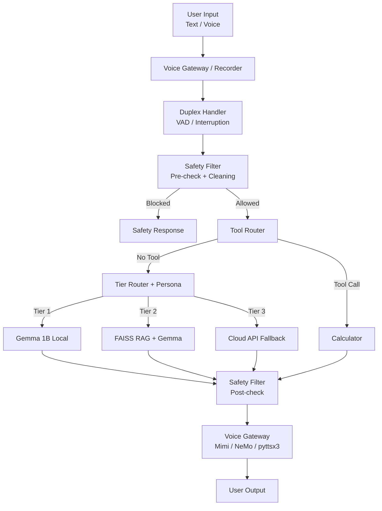

# Elara v2.0 Architecture (Functional)

## System Overview

## Tier Details

### Tier 1: Direct Local Model
- Uses `llama-cpp-python` to run Gemma 3 1B IT (Q4_K_M).
- Optimized for speed and low memory (~600MB RAM).

### Tier 2: RAG with FAISS
- Uses `SentenceTransformers` (all-MiniLM-L6-v2) for embeddings.
- Uses `FAISS` for efficient vector search.
- Injects relevant context into the Tier 1 prompt.

### Tier 3: API Fallback
- Calls external LLMs (via OpenRouter/Together AI) for complex queries.
- Used when specific keywords are detected or local models are insufficient.

## Safety Layer
- Rule-based filtering using `re` and `yaml` configuration.
- Protects against harmful content and PII leaks.
- Performs both pre-generation and post-generation checks.

## Voice Pipeline
- **STT**: OpenAI Whisper (Tiny/Base).
- **Recorder**: Asynchronous capture via `sounddevice`.
- **Full-Duplex**: `DuplexVoiceHandler` manages VAD and interruptions.
- **TTS**:
  - **Mimi**: Preferred high-quality neural codec (~200MB).
  - **NeMo**: GPU-accelerated fallback.
  - **pyttsx3**: Low-resource offline fallback.

## Persona System
- **VoicePersonaManager**: Coordinates voice embeddings and text styles.
- **Voice Conditioning**: Applies persona-specific system prompts to all generation tiers.

## Monitoring & Utilities
- **Memory Monitor**: `elara_core/utils.py` provides real-time tracking of RAM usage to ensure compliance with the 4GB edge device target.
