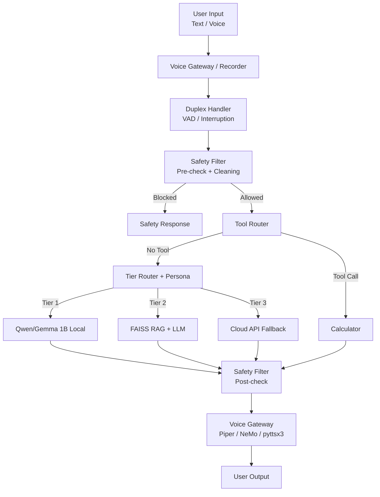

# Elara v2.3 Architecture

## System Overview

## Tier Details

### Tier 1: Direct Local Model
- **Engine**: Qwen2.5-1.5B (default, no auth) or Gemma 3 1B IT (Quantized GGUF).
- **Inference**: Uses `llama-cpp-python` for high-performance CPU/GPU execution.
- **Chat Format**: Auto-detected from model filename (`chatml` for Qwen, `gemma` for Gemma).
- **Role**: Fast, direct responses for general queries.
- **Optimization**: Target memory footprint < 1GB.

### Tier 2: RAG Pipeline
- **Engine**: FAISS vector database + `SentenceTransformers`.
- **Search**: Semantic search using `all-MiniLM-L6-v2` embeddings.
- **Generation**: Reuses the Tier 1 engine with retrieved context injected into the prompt.
- **Fallback**: Standalone extractive mode available if the primary generator is offline.

### Tier 3: API Fallback
- **Interface**: OpenAI-compatible client.
- **Routing**: Triggered by keywords or complex reasoning requirements (via OpenRouter/fallback).
- **Role**: Handles tasks beyond local model capacity.

## Safety Layer
- **Implementation**: Regex-based filtering in `elara_core/safety/filter.py`.
- **Phases**: Pre-check (user input) and Post-check (assistant output).
- **Protection**: Includes redaction and block rules defined in `rules.yaml`.

## Voice Pipeline
- **STT**: OLMoASR (tiny/base/small/medium/large).
  - **License**: Apache 2.0 (fully open, no API keys).
  - **Languages**: English (primary).
  - **Optimization**: Lazy loading, 16kHz PCM input.
- **TTS**:
  - **Piper**: Fast, local neural TTS (22.05kHz). Default engine.
  - **NeMo**: FastPitch + HiFi-GAN (requires GPU, optional).
  - **pyttsx3**: SAPI5/nsss local fallback.
- **Interactive**: `DuplexVoiceHandler` manages asynchronous audio streams and VAD.

## Persona System
- **Management**: `VoicePersonaManager` in `elara_core/persona/voice_persona.py`.
- **Conditioning**: Dynamically swaps voice embeddings and applies system-prompt persona styles to LLM generation.

## Monitoring & Utilities
- **Memory Monitor**: `elara_core/utils.py` tracks available RAM with thresholds: 2GB to load models, 1GB to process requests, 0.5GB critical limit.
