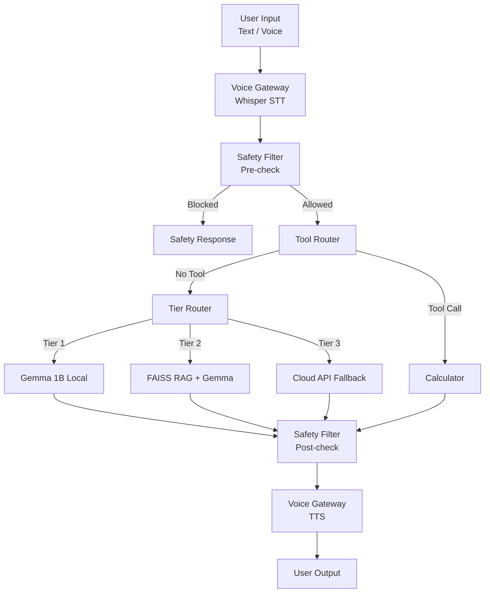

# Elara v2.0 Architecture (Functional)

## System Overview

## Tier Details

### Tier 1: Direct Local Model
- Uses `llama-cpp-python` to run Gemma 3 1B IT (Q4_K_M).
- Optimized for speed and low memory (~600MB RAM).

### Tier 2: RAG with FAISS
- Uses `SentenceTransformers` (all-MiniLM-L6-v2) for embeddings.
- Uses `FAISS` for efficient vector search.
- Injects relevant context into the Tier 1 prompt.

### Tier 3: API Fallback
- Calls external LLMs (via OpenRouter/Together AI) for complex queries.
- Used when specific keywords are detected or local models are insufficient.

## Safety Layer
- Rule-based filtering using `re` and `yaml` configuration.
- Protects against harmful content and PII leaks.
- Performs both pre-generation and post-generation checks.

## Voice Pipeline
- **STT**: OpenAI Whisper (Tiny/Base).
- **TTS**: pyttsx3 (offline fallback) or NVIDIA NeMo (high quality).
